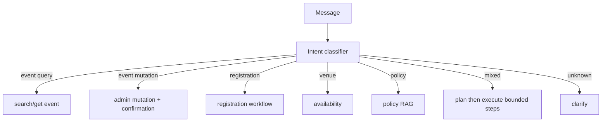

# Agent routing

```mermaid
flowchart TD
 M[Message] --> I[Intent classifier]
 I -->|event query| ES[search/get event]
 I -->|event mutation| EA[admin mutation + confirmation]
 I -->|registration| RG[registration workflow]
 I -->|venue| VA[availability]
 I -->|policy| PS[policy RAG]
 I -->|mixed| HY[plan then execute bounded steps]
 I -->|unknown| CL[clarify]
```

Routing is allow-listed. Ambiguous destructive language routes to clarification; unauthorized intents terminate before tool invocation.

