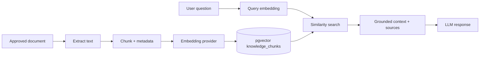

# RAG architecture

```mermaid
flowchart LR
 D[Approved document] --> E[Extract text]
 E --> C[Chunk + metadata]
 C --> V[Embedding provider]
 V --> P[(pgvector knowledge_chunks)]
 Q[User question] --> QE[Query embedding]
 QE --> S[Similarity search]
 P --> S
 S --> CTX[Grounded context + sources]
 CTX --> L[LLM response]
```

Retrieved content is untrusted evidence, not instructions. Responses must cite document/version/chunk metadata and state when evidence is missing.

